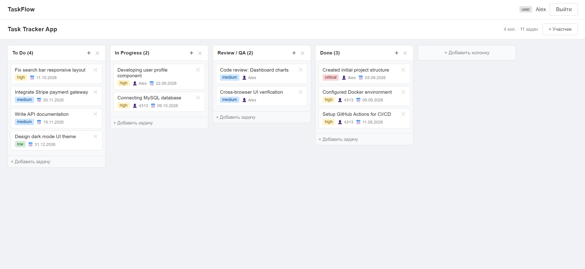

# Task Tracker

[](https://github.com/Iskhakov-06/kanban-task-tracker/actions/workflows/ci.yml)

A Trello-style kanban board: create boards, organize work into columns, drag tasks between them, and collaborate with teammates. Full-stack app with a REST API, JWT authentication and role-based access control.

<!-- Add a screenshot or GIF here: -->
<!--  -->

## Features

- **Kanban boards** with columns and tasks, drag-and-drop (dnd-kit)
- **Authentication**: registration with email verification, login, password reset, JWT access + refresh tokens (refresh token in an HTTP-only cookie)
- **Role-based access control**: global roles (`user` / `moderator` / `admin`) and per-board membership roles
- **Team collaboration**: add and remove board members
- **Task comments** and **activity history** for every task
- **Validation** of all incoming data (express-validator), centralized error handling
- **Structured logging** (winston) and request logging
- **Versioned database migrations** (umzug), applied automatically on startup
- **Automated tests** (Jest + Supertest, 120+ tests against a real MySQL) and a **GitHub Actions** CI pipeline
- **Docker Compose** setup for MySQL + API

## Tech stack

| Layer | Technologies |
|---|---|
| Frontend | React 18, Vite, Redux Toolkit, React Router, Axios, dnd-kit |
| Backend | Node.js 22, Express, Sequelize, umzug (migrations), JWT, bcrypt, Nodemailer, winston |
| Database | MySQL 8 |
| DevOps | Docker, Docker Compose |

## Getting started

### Prerequisites

- Docker with Compose v2 (recommended), or Node.js 22+ and a local MySQL 8

### 1. Clone

```bash
git clone https://github.com/Iskhakov-06/kanban-task-tracker.git
cd kanban-task-tracker
```

### 2. Configure

```bash
cp .env.example .env
```

Fill in `DB_ROOT_PASSWORD`, `DB_PASSWORD` and both JWT secrets
(generate with `node -e "console.log(require('crypto').randomBytes(48).toString('hex'))"`).
SMTP settings are needed for email verification and password reset
(for local development a service like Mailtrap works well).

### 3. Run everything with Docker

```bash
docker compose up --build
```

| Service | URL |
|---|---|
| App (nginx + React build, proxies `/api`) | http://localhost:3000 |
| API | http://localhost:5000 (health check: `GET /health`) |
| MySQL | `127.0.0.1:3306` |

On startup the API applies pending database migrations, so the schema is created automatically (in any `NODE_ENV`).

<details>
<summary>Running without Docker (hot reload)</summary>

Requires Node.js 22+ and a local MySQL 8 instance.

```bash
# backend
cd backend
cp .env.example .env      # fill in DB and SMTP settings
npm install
npm run dev

# frontend (in a second terminal)
cd frontend
npm install
npm run dev               # http://localhost:3000, Vite proxies /api to :5000
```
</details>

## Docker setup

- **Multi-stage builds**: the backend image contains only production dependencies; the frontend is compiled with Vite and served by nginx, so no Node.js in the final image
- **Layer caching**: dependency layers are rebuilt only when `package*.json` change, npm cache is reused between builds (BuildKit)
- **Security**: containers run as non-root users, all Linux capabilities dropped, `no-new-privileges`, secrets are never baked into images (`.dockerignore`)
- **Reliability**: healthchecks on every service, `depends_on` waits for healthy dependencies, `tini` as PID 1 for graceful shutdown
- **nginx**: gzip, immutable caching for hashed assets, SPA fallback, `/api` reverse proxy

## Database migrations

The schema is managed with versioned migrations in `backend/src/migrations`. Pending migrations run automatically when the API starts (set `AUTO_MIGRATE=false` to disable). Applied migrations are tracked in the `SequelizeMeta` table.

```bash
cd backend
npm run migrate          # apply pending migrations
npm run migrate:down     # revert the last migration
npm run migrate:status   # show applied / pending
```

To change the schema, add a new file such as `src/migrations/20261001000000-add-labels.js` exporting `up({ context: queryInterface })` and `down(...)`. Files run in filename order; never edit a migration that has already been applied.

## Testing

Integration tests (Jest + Supertest) run the real Express app against a real MySQL database. They cover authentication (registration, email verification, login, refresh-token rotation, logout, password reset), role-based access control (global and per-board roles), isolation between boards, and the board / column / task / comment logic.

```bash
cd backend
cp .env.test.example .env.test   # DB credentials; the database name must end with "_test"
docker compose up -d db          # from the repo root, or use any local MySQL 8
npm test                         # or: npm run test:coverage
```

The test database is created and migrated automatically. The test runner refuses to start if the database name does not end with `_test`, because tests wipe all tables. Outgoing email is mocked.

CI (`.github/workflows/ci.yml`) runs on every push and pull request: backend tests on a MySQL service container, the frontend build, and a build of both Docker images.

## API overview

| Area | Endpoints |
|---|---|
| Auth | `POST /api/auth/register`, `GET /api/auth/verify-email`, `POST /api/auth/login`, `POST /api/auth/refresh`, `POST /api/auth/logout`, `POST /api/auth/forgot-password`, `POST /api/auth/reset-password`, `GET /api/auth/me` |
| Boards | `GET/POST /api/boards`, `GET/PUT/DELETE /api/boards/:id`, `POST /api/boards/:id/members`, `DELETE /api/boards/:id/members/:userId` |
| Columns | `GET/POST /api/boards/:boardId/columns`, `PUT/DELETE .../:columnId`, `PATCH .../:columnId/move` |
| Tasks | `GET/POST .../columns/:columnId/tasks`, `GET/PUT/DELETE .../:taskId`, `PATCH .../:taskId/move` |
| Comments & history | `POST .../:taskId/comments`, `DELETE .../:taskId/comments/:commentId`, `GET .../:taskId/history` |
| Users | `GET /api/users`, `GET /api/users/:id` |

## Project structure

```
.
├── backend
│   ├── src
│   │   ├── app.js        # Express app (exported, used by tests)
│   │   ├── server.js     # entry point: DB connection, migrations, listen
│   │   ├── config        # database, logger, mailer
│   │   ├── controllers   # request handlers
│   │   ├── middleware    # auth, RBAC, validation, error handling
│   │   ├── migrations    # versioned schema migrations (umzug)
│   │   ├── models        # Sequelize models
│   │   ├── routes
│   │   ├── services      # business logic
│   │   ├── utils
│   │   └── validators
│   ├── tests             # Jest + Supertest integration tests
│   └── Dockerfile
├── frontend
│   ├── Dockerfile
│   ├── nginx.conf
│   └── src
│       ├── api           # axios instance and API calls
│       ├── components
│       ├── pages
│       ├── router
│       └── store         # Redux Toolkit slices
├── .github/workflows     # CI pipeline
├── docker-compose.yml
└── .env.example
```

## Roadmap

- [ ] Real-time updates (WebSockets)
- [ ] Frontend tests
- [ ] Task attachments and labels

## License

MIT
